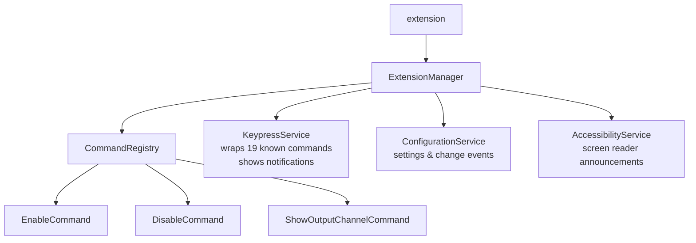
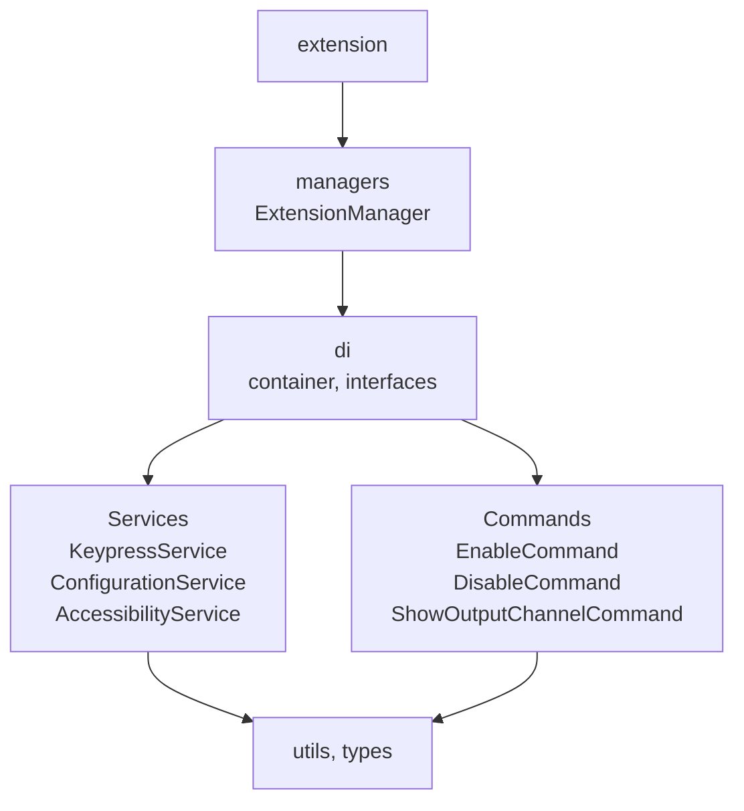

# Repository Guidelines

## Project Structure & Module Organization

This is a TypeScript VS Code extension. Source code lives in `src/`: command handlers in `src/commands/`, services in `src/services/`, dependency injection in `src/di/`, managers in `src/managers/`, shared types in `src/types/`, and helpers in `src/utils/`. Unit tests are in `test/unit/`, integration tests in `test/suite/`, mocks in `test/__mocks__/`, and fixtures in `test/fixtures/`. Packaged extension assets are in `public/`. Do not edit generated output in `dist/` or `out-test/`.

## Build, Test, and Development Commands

- `pnpm install`: install dependencies.
- `pnpm run build`: bundle the extension with esbuild.
- `pnpm run watch`: rebuild during extension development.
- `pnpm run lint`: run ESLint against `src/`.
- `pnpm run lint:fix`: apply automatic ESLint fixes.
- `pnpm run format`: format the repository with Prettier.
- `pnpm run check-types`: TypeScript type checking (no emit).
- `pnpm run test:unit`: run Vitest unit tests.
- `pnpm run test:unit:coverage`: run Vitest unit tests and produce `coverage/lcov.info`.
- `pnpm run test:integration`: compile tests and run VS Code integration tests.
- `pnpm run package`: create a `.vsix` package.

Use Node.js 22+ and pnpm. Development uses Node 24 LTS (`.nvmrc` = `lts/jod`). For manual testing, open the repo in VS Code and press `F5`.

## Coding Style & Naming Conventions

Write TypeScript and keep modules focused by responsibility. Use PascalCase for classes and service files such as `KeypressService.ts`, camelCase for functions and variables, and command names matching package command IDs. Prettier handles formatting; ESLint enforces quality and security rules. Avoid committing compiled `.js` or `.js.map` files under `src/`, `test/`, or `scripts/`.

## Testing Guidelines

Add unit tests in `test/unit/*.test.ts` for services, utilities, and validators. Add integration tests in `test/suite/*.test.ts` when changes touch VS Code commands, keybindings, notifications, or editor interactions. Use `test/fixtures/` when possible. Run integration tests before user-facing behavior changes.

## Commit & Pull Request Guidelines

Use Conventional Commits, for example `feat(keypress): add new shortcut wrapper`, `fix(config): respect logLevel setting`, or `test(unit): cover KeypressService`. Hooks and CI enforce a maximum of 10 files and 400 changed lines per commit. Sweeping refactors may add the `size/override` label to the PR to bypass the CI hard-fail. Branch from `main` using prefixes such as `feature/`, `fix/`, `docs/`, or `refactor/`.

Pull requests should include a clear description, linked issues when applicable, and screenshots or recordings for visible VS Code UI changes. Before opening a PR, run `pnpm run lint`, `pnpm run build`, and relevant tests. Workflow or community automation changes should also update `README.md`, `CHANGELOG.md`, `CLAUDE.md`, `CONTRIBUTING.md`, and `.github/copilot-instructions.md` when commands or maintainer procedures change.

## Architecture

### Runtime Architecture

### Codebase Structure

## Security & Configuration Tips

Do not commit secrets, local VS Code state, generated packages, coverage output, or build artifacts. Review `SECURITY.md` for vulnerability reporting. Configuration changes should update `package.json`, related types in `src/types/`, and tests together. Third-party tooling changes should keep `THIRDPARTY.md` current.

CI and release workflows use GitHub Actions cache for pnpm package storage and `node_modules` warm starts. `.github/workflows/cache-cleanup.yml` runs every 3 days at 08:00 IST and removes cache entries not used for 7 days or more. Keep workflow cache docs aligned across README, CHANGELOG, CLAUDE.md, CONTRIBUTING.md, AGENTS.md, and `.github/copilot-instructions.md`.

## Assistant Conventions

### Communication

Default to **caveman mode** (terse: drop articles/filler/pleasantries; fragments OK). Keep technical substance exact. Code/commits/PRs/security warnings stay in normal English. Disable on request ("normal mode").

### Shell commands

Prepend `rtk` to all shell invocations when available — 60-90% token savings on dev ops. Examples: `rtk git status`, `rtk pnpm test`, `rtk ls`. Fallback to direct command if `rtk` unavailable, or for compound predicates (`find -not`, `find -exec`) which rtk does not support.
