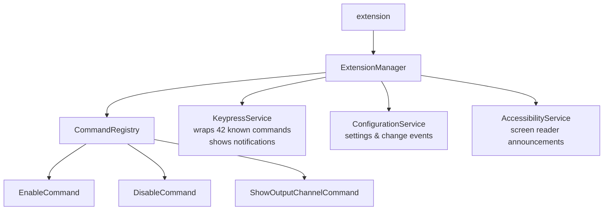
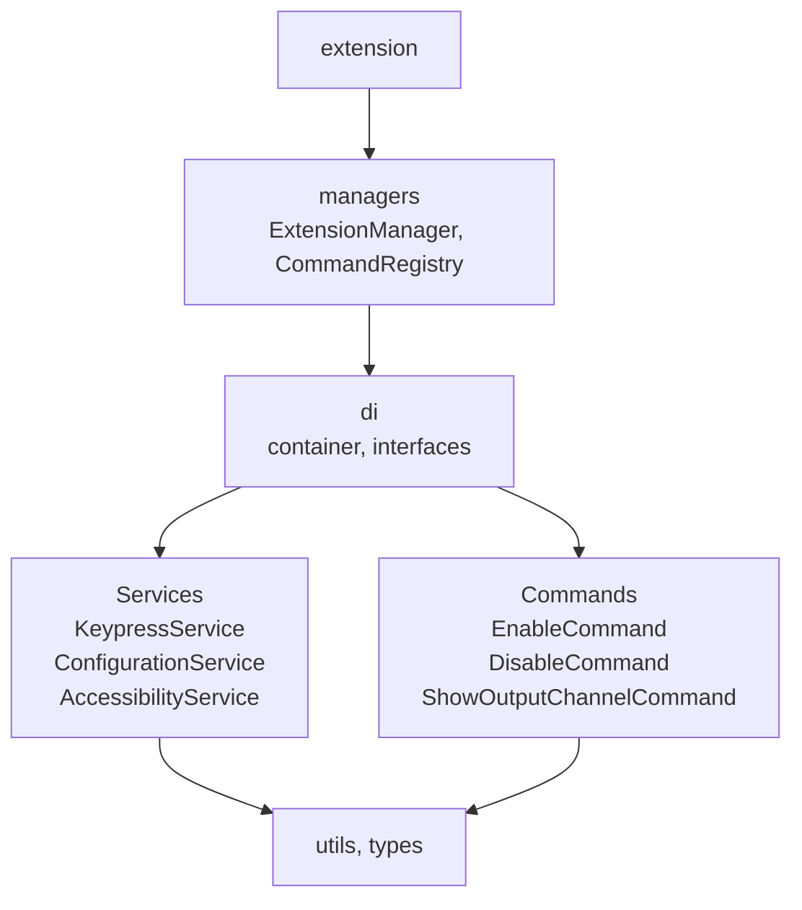

# ARCHITECTURE.md

## 1. System Overview & Architecture

Keypress Notifications is a VS Code extension built to provide immediate on-screen visual feedback for keyboard shortcuts. The system architecture is designed with a Dependency Injection (DI) pattern, ensuring strict separation of concerns, high testability, and zero runtime dependencies.

### Data Flow

1. A user triggers a known VS Code keybinding (e.g., `Ctrl+S`).
2. VS Code intercepts the shortcut and invokes our wrapper command (e.g., `keypress-notifications.wrapper.workbench_action_files_save`) registered by the `CommandRegistry`.
3. The `KeypressService` executes the original VS Code command (`workbench.action.files.save`) via the Extension API.
4. Concurrently, the `KeypressService` invokes the VS Code Window API to display a non-blocking toast notification containing the corresponding shortcut label (e.g., "You've pressed Ctrl+S").

### Component Boundaries

- **Frontend (VS Code UI):** Handled entirely natively via VS Code's `vscode.window.showInformationMessage` and native command execution.
- **Backend (Extension Host):** Node.js runtime hosting our DI container, services, and command handlers.
- **Configuration (Storage):** Relies on the VS Code Settings API; the extension does not maintain its own persistence layer.

### Architecture Diagrams

#### Runtime Architecture

#### Codebase Structure

## 2. Codebase Structure & Modules

The repository is organized to separate concerns, primarily living inside `/src`:

- `/src/extension.ts`: The activation entry point that initializes the DI container and bootstraps the `ExtensionManager`.
- `/src/di/`: Houses the DI container (singleton pattern), DI token constants (`types.ts`), and all service interfaces (`interfaces/`).
- `/src/managers/`:
  - `ExtensionManager.ts`: Lifecycle coordinator that wires services, commands, and disposables.
  - `CommandRegistry.ts`: Responsible for registering all VS Code commands with the extension context.
- `/src/commands/`: Command handlers extending `BaseCommandHandler` (e.g., `EnableCommand`, `DisableCommand`).
- `/src/services/`: Core business logic containing:
  - `KeypressService.ts`: Wraps 42 known VS Code commands and handles the notification logic.
  - `ConfigurationService.ts`: Interfaces with VS Code settings and listens for changes.
  - `AccessibilityService.ts`: Helper logic for screen reader announcements.
- `/src/utils/`: Shared utilities including the `logger.ts` singleton and configuration validators.
- `/test/`: Split into `unit/` (Vitest with mocked VS Code API) and `suite/` (Mocha integration tests against a live VS Code host).

## 3. Data Model & Storage

The extension is strictly stateless between sessions and does not utilize a traditional database or persistent caching layer of its own.

### Configuration State

All configuration and state are persisted natively in the VS Code Workspace/User settings file (`settings.json`). The `ConfigurationService` actively subscribes to `vscode.workspace.onDidChangeConfiguration` events.

- **`keypress-notifications.enabled`**: Boolean flag to toggle notifications.
- **`keypress-notifications.minimumKeys`**: Integer defining the minimum number of keys in a shortcut combination.
- **`keypress-notifications.excludedCommands`**: Array of string command IDs to skip.
- **`keypress-notifications.showCommandName`**: Boolean flag to append the VS Code command ID to the toast message.
- **`keypress-notifications.logLevel`**: Enum (`debug`, `info`, `warn`, `error`) mapped to a numeric logger state.

## 4. API & Interface Specifications

### Exposed Commands

| Command ID                                 | Action                                                       | Payload |
| ------------------------------------------ | ------------------------------------------------------------ | ------- |
| `keypress-notifications.enable`            | Enables the extension notifications globally.                | None    |
| `keypress-notifications.disable`           | Disables the extension notifications globally.               | None    |
| `keypress-notifications.showOutputChannel` | Opens the extension's dedicated output channel in the Panel. | None    |

### Keybinding Wrappers (Internal API)

The `KeypressService` dynamically generates wrapper commands for 42 native VS Code commands. They follow the format `keypress-notifications.wrapper.<command_id_with_dots_replaced_by_underscores>`.

## 5. Local Development Setup & Configuration

### Prerequisites

- **Node.js**: >=22 runtime (Development strictly uses Node 24 LTS via `.nvmrc`).
- **Package Manager**: pnpm (`>=10`).
- **VS Code**: Version `1.111.0` or later.

### Setup Instructions

1. Clone the repository: `git clone https://github.com/Vijay431/keypress-notifications.git`
2. Enter the directory: `cd keypress-notifications`
3. Install dependencies: `pnpm install`
4. Build the extension bundle: `pnpm run build` (or `pnpm run watch` for continuous compilation).
5. Launch the Extension Development Host: Open the workspace in VS Code and press **F5**.

_Note: The extension uses `esbuild` for rapid bundling without relying on webpack or rollup._

## 6. Testing & Quality Assurance

The project enforces high code quality through rigorous automated testing and linting, split by layers.

### Unit Testing

- **Tool**: Vitest
- **Command**: `pnpm run test:unit` (or `pnpm run test:unit:coverage` for LCOV reports).
- **Scope**: Tests infrastructure utilities and services. The native VS Code API is entirely mocked out (`test/__mocks__/vscode.ts`) to ensure speed and isolation.

### Integration Testing

- **Tool**: Mocha + `@vscode/test-electron`
- **Command**: `pnpm run test:integration` (Compiles TS tests and launches them in a live Extension Host).
- **Scope**: Feature-level End-to-End verification. Requires a GUI or `xvfb-run -a` on headless Linux CI environments.

### Linting & Formatting

- **Lint**: `pnpm run lint` leverages ESLint to enforce strict rules and prevent usage of `any`.
- **Format**: `pnpm run format` runs Prettier across the codebase.
- **Types**: `pnpm run check-types` executes a strict TypeScript compilation check with `--noEmit`.

## 7. Deployment & CI/CD Pipeline

The project relies entirely on GitHub Actions for Continuous Integration and Continuous Deployment.

### CI Gates (`ci.yml`)

Runs on every PR and commit to `main`. It executes linting, unit tests with coverage generation, integration tests across a matrix, and build verification.

### Security Pipeline

- **`security-pr.yml`**: Runs `pnpm audit` on high/critical levels and `actions/dependency-review-action` to gate dependency additions.
- **`security-daily.yml`**: Cron job running `pnpm audit` every day at 02:00 UTC.

### Deployment (`release.yml`)

Triggered strictly by pushing a `v*` tag.

- The pipeline builds the `.vsix` package via `vsce`.
- Depending on the tag format (e.g., `-rc`, `-beta`), it automatically flags the release as a `--pre-release` or stable.
- Publishes the extension payload concurrently to both the **VS Code Marketplace** (using `vsce publish`) and the **Open VSX Registry** (using `ovsx publish`).
- Automatically drafts and publishes a GitHub Release with the attached `.vsix` artifact.

## 8. Troubleshooting & Edge Cases

1. **Custom / Remapped Keybindings Bypass Wrappers**
   - **Failure Point:** If a user remaps a default keybinding to a custom VS Code command that isn't one of the 42 curated commands, the notification will not trigger.
   - **Recovery/Handling:** The extension's architecture is explicitly bounded to known commands. Users must either revert to supported commands or open an issue to request coverage for the new command ID.

2. **Older VS Code Engine Incompatibility**
   - **Failure Point:** Attempting to install the extension on a VS Code version older than `1.111.0`.
   - **Recovery/Handling:** Handled by the engine bounds in `package.json`. VS Code will natively block the installation, preventing API incompatibility crashes at runtime.

3. **Conflicting Extension Keybindings**
   - **Failure Point:** Another installed extension explicitly overrides the same shortcut `when` clauses used by `keypress-notifications.wrapper.*`.
   - **Recovery/Handling:** Users can utilize VS Code's "Keyboard Shortcuts Troubleshooting" to identify the conflict. The extension logs key registration failures to its Output Channel (`Keypress Notifications: Show Status`), allowing developers to debug initialization errors without crashing the Extension Host.
