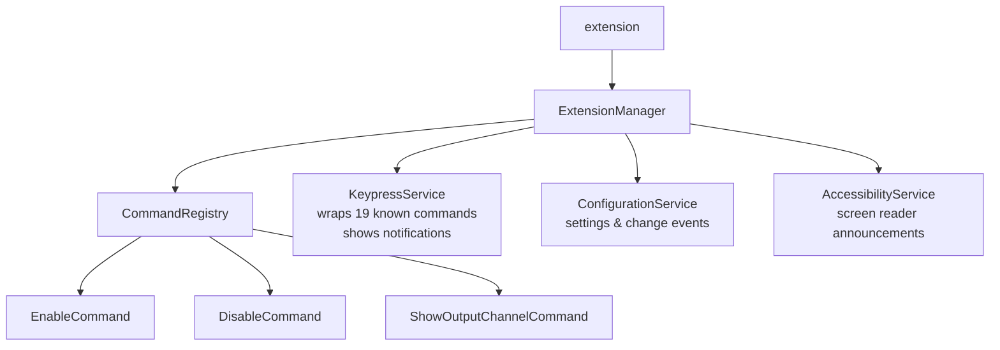
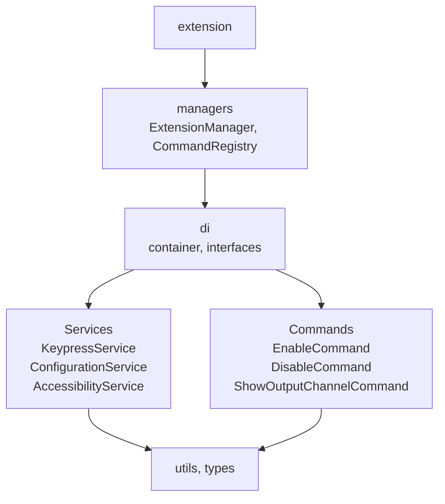

# CLAUDE.md

This file provides guidance to Claude Code (claude.ai/code) when working with code in this repository.

This file is the single source of truth for the **Keypress Notifications** VS Code extension. Update it whenever architecture, commands, or conventions change.

---

## Project Overview

- **Name:** Keypress Notifications
- **Publisher:** VijayGangatharan
- **Version:** 2.0.0
- **VS Code engine:** >=1.111.0 (last 10 minor versions; 1.111–1.120)
- **Node.js:** >=22 runtime (22, 24, 26 supported); dev uses Node 24 LTS (`lts/jod`)
- **Package manager:** pnpm (`pnpm-workspace.yaml` owns `overrides` and `allowBuilds`; do not put them in `package.json`)
- **Language:** TypeScript (strict mode)
- **Bundle tool:** esbuild (via `esbuild.config.ts`)
- **Published to:** VS Code Marketplace and Open VSX Registry
- **Runtime dependencies:** none (devDependencies only)

---

## Development Commands

```bash
pnpm install              # install dependencies
pnpm run build            # build extension (~1s)
pnpm run watch            # watch mode
pnpm run clean            # remove dist/ and *.vsix
pnpm run rebuild          # clean + build + package
pnpm run package          # production build (.vsix)
pnpm run lint             # ESLint
pnpm run lint:fix         # auto-fix lint issues
pnpm run format           # format files with Prettier
pnpm run check-types      # TypeScript type checking (no emit)
pnpm run test:unit        # run unit tests (Vitest)
pnpm run test:unit:coverage # run unit tests with LCOV coverage
pnpm run test:integration # run integration tests (Mocha + VS Code, requires display)
pnpm run publish          # publish to VS Code Marketplace
pnpm run publish:openvsx  # publish to Open VSX Registry
```

Run a single unit test file: `pnpm run test:unit -- test/unit/logger.test.ts`
Run tests matching a name pattern: `pnpm run test:unit -- -t "should notify"`

Press **F5** in VS Code to launch the Extension Development Host.

---

## Source Structure

```
src/
  extension.ts                  # activation entry point
  managers/
    ExtensionManager.ts         # lifecycle coordinator — wires services, commands, disposables
    CommandRegistry.ts          # registers all VS Code commands with the context
  commands/
    BaseCommandHandler.ts       # abstract base with error handling
    ICommandHandler.ts          # command handler interface
    EnableCommand.ts            # keypress-notifications.enable
    DisableCommand.ts           # keypress-notifications.disable
    ShowOutputChannelCommand.ts # keypress-notifications.showOutputChannel
    index.ts
  services/
    KeypressService.ts          # wraps 19 known commands; shows notifications on execution
    ConfigurationService.ts     # VS Code settings access and change events
    AccessibilityService.ts     # screen reader announcements and ARIA helpers
    index.ts
  di/
    container.ts                # DI container (singleton pattern)
    types.ts                    # DI token constants
    interfaces/                 # all service interfaces
    index.ts
  types/
    config.ts
    extension.ts
    vscode.ts
  utils/
    logger.ts
    configValidator.ts
    accessibilityHelper.ts
public/                         # packaged extension assets (images, screenshots)
test/
  __mocks__/vscode.ts           # minimal vscode mock for Vitest unit tests
  unit/                         # Vitest unit tests (infrastructure, no VS Code API)
  suite/                        # Mocha integration tests (feature-level, live VS Code)
  fixtures/                     # test fixture files
  runTests.ts                   # @vscode/test-electron launcher
vitest.config.ts                # Vitest config (aliases vscode to mock)
tsconfig.test.json              # TypeScript config for compiling integration tests
```

---

## Services

### Canonical Sources

- **`package.json` `contributes`** — canonical source for all command IDs, settings, and keybindings (VS Code loads it directly).
- **`README.md`** — canonical user-facing narrative.
- **`CLAUDE.md`** — canonical architecture and dev conventions.

### Architecture Diagrams

**Runtime Architecture**



**Codebase Structure**



### User-Facing Commands (3)

`package.json` `contributes.commands` is the canonical command-ID list.

| Feature            | Command ID                                     |
| ------------------ | ---------------------------------------------- |
| Enable             | `keypress-notifications.enable`                |
| Disable            | `keypress-notifications.disable`               |
| Show Status        | `keypress-notifications.showOutputChannel`     |

### Infrastructure Services (3)

| Service               | Source File                               | Purpose                                                     |
| --------------------- | ----------------------------------------- | ----------------------------------------------------------- |
| KeypressService       | `src/services/KeypressService.ts`         | Wraps 19 known VS Code commands; shows notifications        |
| ConfigurationService  | `src/services/ConfigurationService.ts`    | VS Code settings access and change events                   |
| AccessibilityService  | `src/services/AccessibilityService.ts`    | Screen reader announcements and ARIA helpers                |

### Keybinding Wrappers (19)

The core feature: `KeypressService` registers wrapper commands for exactly 19 known VS Code commands. When a user triggers one of these keybindings, the wrapper executes the original command and shows a VS Code notification.

| Shortcut              | Wrapped Command                                            |
| --------------------- | ---------------------------------------------------------- |
| Ctrl+C / Cmd+C        | `editor.action.clipboardCopyAction`                        |
| Ctrl+X / Cmd+X        | `editor.action.clipboardCutAction`                         |
| Ctrl+V / Cmd+V        | `editor.action.clipboardPasteAction`                       |
| Ctrl+Shift+P          | `workbench.action.showCommands`                            |
| Ctrl+P / Cmd+P        | `workbench.action.quickOpen`                               |
| Ctrl+S / Cmd+S        | `workbench.action.files.save`                              |
| Ctrl+K Ctrl+S         | `workbench.action.files.saveAll`                           |
| Ctrl+N / Cmd+N        | `workbench.action.files.newUntitledFile`                   |
| Ctrl+O / Cmd+O        | `workbench.action.files.openFile`                          |
| Ctrl+Shift+F          | `workbench.action.findInFiles`                             |
| Ctrl+G / Cmd+G        | `workbench.action.gotoLine`                                |
| Ctrl+B / Cmd+B        | `workbench.action.toggleSidebarVisibility`                 |
| Ctrl+`                | `workbench.action.terminal.toggleTerminal`                 |
| Ctrl+J / Cmd+J        | `workbench.action.togglePanel`                             |
| Ctrl+W / Cmd+W        | `workbench.action.closeActiveEditor`                       |
| Ctrl+Shift+N          | `workbench.action.newWindow`                               |
| Shift+Alt+F           | `editor.action.formatDocument`                             |
| Ctrl+/  / Cmd+/       | `editor.action.commentLine`                                |
| Ctrl+D / Cmd+D        | `editor.action.addSelectionToNextFindMatch`                |

---

## Key Design Decisions

### KeypressService — Bounded Wrapper Registration

`KeypressService` registers wrapper commands for a fixed set of 19 known commands (listed above). The wrapper pattern:

1. A `keypress-notifications.wrapper.<command_id_with_dots_replaced>` command is registered.
2. When triggered, it executes the original command via `vscode.commands.executeCommand`.
3. It then shows a `vscode.window.showInformationMessage` notification with the shortcut key label.
4. Registration is bounded to exactly these 19 commands — not all VS Code commands.

### DI Container Pattern

- All services are singletons, registered in `src/di/container.ts` via `container.registerSingleton(TYPES.Token, factory)`.
- Services are instantiated via static factory methods (`ServiceName.create(...)`) or `ServiceName.getInstance()` — not `new ServiceName()`.
- DI tokens are `symbol` constants defined in `src/di/types.ts`; interfaces live in `src/di/interfaces/`.
- Child containers (`container.createChild()`) are supported for test isolation.
- **`ExtensionManager`** receives its 4 service dependencies (`ILogger`, `IConfigurationService`, `IKeypressService`, `IAccessibilityService`) via constructor injection. `extension.ts` resolves them from the container using `getService<T>(TYPES.X)` after `initializeContainer()`. Do not use lazy getters (`get serviceName()`) that call `getService` inside the class.

### Command Handler Pattern

All commands are class-based (`src/commands/`), implementing `ICommandHandler` with a `BaseCommandHandler` base class. `CommandRegistry` iterates the registered handlers and calls `vscode.commands.registerCommand`.

### Logger and Log Level

`Logger` is a singleton utility in `src/utils/logger.ts`. Log level is read from `keypress-notifications.logLevel` (string) and mapped to the numeric `LogLevel` enum on activate and on every config change event. `Logger.setLogLevel()` must be called when the setting changes — this is wired in `ExtensionManager`.

### No `fs` Usage

The extension does not access the filesystem directly. Do not introduce `fs` imports.

### No `any`

TypeScript strict mode is enabled. Do not use `any`. Use `unknown` with narrowing, or proper typed interfaces.

---

## Settings Reference

| Key                                        | Type    | Default  | Description                                        |
| ------------------------------------------ | ------- | -------- | -------------------------------------------------- |
| `keypress-notifications.enabled`           | boolean | `true`   | Enable/disable the extension                       |
| `keypress-notifications.minimumKeys`       | number  | `2`      | Minimum keys in combination to show notification   |
| `keypress-notifications.excludedCommands`  | array   | `[]`     | Commands to exclude from notifications             |
| `keypress-notifications.showCommandName`   | boolean | `false`  | Show the command name in the notification          |
| `keypress-notifications.logLevel`          | enum    | `"info"` | Log level: `debug`, `info`, `warn`, `error`        |

---

## Release & Versioning Strategy

This project follows [SemVer 2.0.0](https://semver.org/spec/v2.0.0.html). Pre-release vs stable is determined by **tag suffix only**.

### Automation Layout

- `.github/workflows/ci.yml` runs PR/main quality gates: lint, unit coverage, integration tests, build matrix, `pnpm audit --audit-level=high` (audit job), and dependency review (dependency-review job, PR only).
- `.github/workflows/release.yml` runs only on `v*` tag pushes: package, verify, publish to VS Code Marketplace and Open VSX, and create a GitHub Release.
- `.github/workflows/security-audit.yml` runs daily at 02:00 UTC and on `pnpm-lock.yaml`/`package.json` changes on `main`; uses `pnpm audit` (respects pnpm overrides) and creates an issue only when high/critical vulnerabilities are found.
- `.github/workflows/cache-cleanup.yml` runs every 3 days at 08:00 IST and removes GitHub Actions cache entries not used for 7 days or more.
- Community automation lives in `.github/workflows/stale.yml`, `.github/workflows/labels-sync.yml`, `.github/workflows/all-contributors.yml`, and `.github/workflows/cache-cleanup.yml`.
- Release publishing requires `VSCE_PAT` and `OVSX_PAT`.

CI caches dependencies solely by warming `node_modules` through `actions/cache`, keyed on `node-modules-${{ runner.os }}-node${{ matrix.node-version }}-${{ hashFiles('pnpm-lock.yaml') }}`. Do not enable `cache: pnpm` on `actions/setup-node` — restore-only jobs never run `pnpm install`, so its post-job store-save step fails with `Path Validation Error` (the pnpm store path never gets created). Keep the OS and Node version in the key so native modules built for one environment never restore into another, and keep it tied to `pnpm-lock.yaml` so stale dependency installs do not leak across lockfile changes.

### How Release Detects Pre-release

The release workflow `setup` job checks the tag for `-rc`, `-next`, `-beta`, or `-alpha`:

```bash
if echo "$VERSION" | grep -qE '\-(rc|next|beta|alpha)'; then
  echo "is_prerelease=true"
fi
```

- Pre-release tags → both marketplaces publish with `--pre-release`
- Stable tags → both marketplaces publish as stable

### Release Checklist

**Stable release (`v2.0.0`):**

1. Ensure `package.json` version is `2.0.0`
2. Push tag: `git tag v2.0.0 && git push origin v2.0.0`
3. Release workflow publishes to VS Code Marketplace + Open VSX, creates GitHub Release

**Pre-release (`v2.1.0-beta.1`):**

1. Bump `package.json` version to `2.1.0`
2. Push tag: `git tag v2.1.0-beta.1 && git push origin v2.1.0-beta.1`
3. Release workflow publishes with `--pre-release` to both marketplaces

---

## Steps to follow

- All new changes should be added to the `CLAUDE.md` file
- All new changes that are user visible should be added to `public/` and `README.md`
- All new changes should be logged in the `CHANGELOG.md` file under unreleased section
- Community automation changes should update `AGENTS.md`, `CONTRIBUTING.md`, `.github/copilot-instructions.md`, and `THIRDPARTY.md` when commands, workflow ownership, or dependency notices change.
- Configuration or command behavior changes must update `package.json`, related types in `src/types/`, tests, and docs together.
- Third-party tooling changes must keep `THIRDPARTY.md` current.

## Commit & Branch Conventions

Use [Conventional Commits](https://www.conventionalcommits.org/):

- `feat(keypress): add new shortcut wrapper`
- `fix(config): wire logLevel on config change`
- `test(unit): cover AccessibilityService`

**Commit size limits** (enforced by hooks and CI): max **10 files** and **400 changed lines** per commit. Sweeping refactors that exceed these limits may add the `size/override` label to the PR to bypass the CI hard-fail (warning comment is still posted).

Branch naming: `feature/`, `fix/`, `docs/`, or `refactor/` prefix from `main`.

## Test Conventions

- **Unit tests** (`test/unit/`, run with `pnpm run test:unit`): infrastructure utilities and services where VS Code API is mocked. No live VS Code instance required.
- **Coverage** (`pnpm run test:unit:coverage`): Vitest coverage output is written to `coverage/lcov.info`.
- **Integration tests** (`test/suite/`, run with `pnpm run test:integration`): feature-level tests that exercise commands end-to-end in a real VS Code Extension Development Host.
- **No separate E2E layer**: The integration suite already drives a real VS Code Extension Development Host. Do not add a separate e2e folder.
- Integration test build output goes to `out-test/` (not `dist/`). The script is `pnpm run test:integration`. Compile errors fail the build.
- Never add VS Code API-dependent logic to unit tests; never add pure-logic tests to the integration suite.
- On Linux CI, integration tests run under `xvfb-run -a`.
- All test descriptions must start with `"should "` (e.g. `it('should show notification', ...)`).
- Run integration tests before any change to commands, keybindings, notifications, or editor interactions.

---

## Assistant Conventions

### Communication

Default to **caveman mode** (terse: drop articles/filler/pleasantries; fragments OK). Keep technical substance exact. Code/commits/PRs/security warnings stay in normal English. Disable on request ("normal mode").

### Shell commands

Prepend `rtk` to all shell invocations when available — 60-90% token savings on dev ops. Examples: `rtk git status`, `rtk pnpm test`, `rtk ls`. Fallback to direct command if `rtk` unavailable, or for compound predicates (`find -not`, `find -exec`) which rtk does not support.
