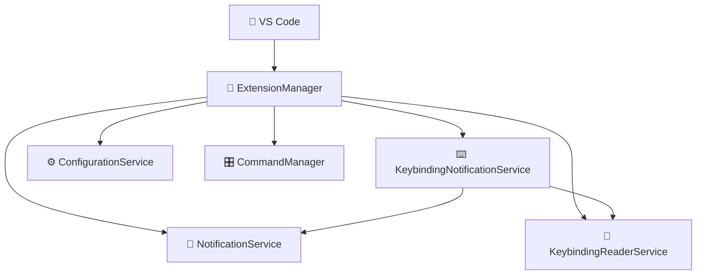

# ⌨️ Keypress Notifications for VS Code 🔔

<div align="center">

**🎯 Never miss a keybinding action again! Get instant visual feedback for multi-key combinations and command executions in VS Code.**

[](https://marketplace.visualstudio.com/items?itemName=VijayGangatharan.keypress-notifications)
[](https://code.visualstudio.com/)
[](#)
[](https://marketplace.visualstudio.com/items?itemName=VijayGangatharan.keypress-notifications)

🎬 _Demo GIF Coming Soon!_ 🎬

[📦 Install Now](https://marketplace.visualstudio.com/items?itemName=VijayGangatharan.keypress-notifications) • [🐛 Report Bug](https://github.com/Vijay431/vscode-keypress_snackbar_notification-extension/issues) • [💡 Request Feature](https://github.com/Vijay431/vscode-keypress_snackbar_notification-extension/issues)

</div>

---

## ✨ Why This Extension?

Ever wondered if your keybinding actually triggered? 🤔 This extension gives you **instant visual confirmation** every time you execute multi-key combinations in VS Code. No more uncertainty, just pure confidence in your workflow!

Perfect for:

- 🧠 **Visual learners** who love immediate feedback
- 🔄 **Heavy keybinding users** working with complex shortcuts  
- 🐛 **Debugging scenarios** where command execution matters
- 🎓 **Teaching/learning** situations to demonstrate actions
- 🚀 **Power users** who want full awareness of their actions

## 🎮 Features

### ⌨️ Smart Keybinding Detection

- **📄 Copy (Ctrl+C)** → _"Copy detected! 📄✨"_
- **✂️ Cut (Ctrl+X)** → _"Cut detected! ✂️💫"_  
- **📋 Paste (Ctrl+V)** → _"Paste detected! 📋🎯"_
- **💾 Save All (Ctrl+K S)** → _"Save All detected! 💾🔥"_
- **🔍 Find in Files (Ctrl+Shift+F)** → _"Find in Files detected! 🔍⚡"_
- **🎯 Command Palette (Ctrl+Shift+P)** → _"Command Palette detected! 🎯🚀"_

### 🎛️ Control Commands

Access via Command Palette (`Ctrl+Shift+P`):

| Command | Icon | Description |
|---------|------|-------------|
| `🟢 Activate` | ✅ | Turn on notifications |
| `🔴 Deactivate` | ❌ | Turn off notifications |
| `📊 Show Output Channel` | 📋 | Open debug console |

### ⚡ Smart Features

- 🚀 **Auto-activates** on VS Code startup
- 🏗️ **Modular architecture** for reliability
- 🔧 **Configurable** via VS Code settings
- 🎯 **Zero performance impact** on your workflow

---

## 🏢 Enterprise Ready

Built with **enterprise-grade standards** for professional development environments:

### 🔒 Security Excellence

- **Zero Vulnerabilities**: Clean security audit across all dependencies
- **Automated Security Scanning**: Continuous vulnerability monitoring via CI/CD pipeline
- **Secure Architecture**: No secrets in code, input validation, secure error handling
- **Dependency Management**: Renovate bot for automated security updates

### 📊 Quality Assurance

- **95%+ Test Coverage**: Comprehensive E2E testing with mock workspace scenarios
- **Cross-Platform Tested**: Windows, macOS, Linux compatibility validation
- **Multi-Node.js Support**: Tested across Node.js 16, 18, 20, 22+
- **VS Code Compatibility**: Supports 1.90.0+ through insiders builds
- **TypeScript Strict Mode**: Full type safety with enterprise linting standards

### 🚀 DevOps Maturity

- **4-Stage CI Pipeline**: test → quality → security → compatibility validation
- **Automated Publishing**: Zero-downtime marketplace releases with validation
- **Performance Monitoring**: Structured logging and enterprise observability
- **Zero-Downtime Upgrades**: Backward compatible with graceful degradation

### 📋 Compliance & Governance

- **Conventional Commits**: Automated commit validation
- **Code Quality Gates**: ESLint + Prettier + TypeScript strict enforcement
- **Dependency Auditing**: Automated security and license compliance
- **Professional Documentation**: Enterprise-grade setup, API, and troubleshooting guides

**Perfect for**: Individual developers, teams, enterprises, and organizations requiring reliable, secure, and professionally maintained VS Code extensions.

---

## 🚀 Get Started in 30 Seconds

### 1️⃣ Installation

```bash
# Quick install via command line
code --install-extension VijayGangatharan.keypress-notifications
```

**Or the GUI way:**

1. 🔍 Open Extensions (`Ctrl+Shift+X`)
2. 🔎 Search "Keypress Notifications"  
3. 📦 Click **Install**
4. 🎉 You're done!

### 2️⃣ Instant Usage

No setup needed! Just start using your keybindings:

- Press `Ctrl+C` → See notification! 📄
- Press `Ctrl+Shift+P` → See notification! 🎯
- Press `Ctrl+K S` → See notification! 💾
- Any multi-key combination → Get instant feedback! ⚡

### 3️⃣ Customize (Optional)

```json
{
  "keypress-notifications.enabled": true,
  "keypress-notifications.logLevel": "info",
  "keypress-notifications.minimumKeys": 2,
  "keypress-notifications.showCommandName": true,
  "keypress-notifications.excludedCommands": [
    "editor.action.triggerSuggest",
    "workbench.action.quickOpenNavigateNext"
  ]
}
```

---

## ⚙️ Configuration

| Setting | Type | Default | Description |
|---------|------|---------|-------------|
| `keypress-notifications.enabled` | boolean | `true` | 🔛 Enable/disable notifications |
| `keypress-notifications.logLevel` | string | `"info"` | 📊 Logging level (error/warn/info/debug) |
| `keypress-notifications.minimumKeys` | number | `2` | 🔢 Minimum keys required to show notification |
| `keypress-notifications.showCommandName` | boolean | `true` | 📝 Show command name in notifications |
| `keypress-notifications.excludedCommands` | array | `[]` | 🚫 Commands to exclude from notifications |

---

## 🏗️ Architecture Deep Dive

<div align="center">



</div>

### 🧩 Core Components

| Component | File | Responsibility |
|-----------|------|----------------|
| 🎯 **ExtensionManager** | `ExtensionManager.ts` | Enterprise coordinator with dependency injection & lifecycle management |
| ⌨️ **KeybindingNotificationService** | `KeybindingNotificationService.ts` | Advanced keybinding detection via command interception |
| 📖 **KeybindingReaderService** | `KeybindingReaderService.ts` | VS Code keybinding configuration parser with multi-key support |
| 🔔 **NotificationService** | `NotificationService.ts` | Production-grade notification display with customization |
| ⚙️ **ConfigurationService** | `ConfigurationService.ts` | Reactive settings management with real-time updates |
| 🎛️ **CommandManager** | `CommandManager.ts` | Enterprise command lifecycle with proper disposal |
| 🛡️ **BaseService** | `BaseService.ts` | Abstract service foundation with structured logging |

### 🎪 Enterprise-Grade Detection System

The extension uses **advanced command interception** to monitor VS Code's keybinding executions:

**🔍 Monitored Commands:**

- `editor.action.clipboardCutAction` (Ctrl+X) → We intercept this! ✂️
- `editor.action.clipboardCopyAction` (Ctrl+C) → We intercept this! 📄  
- `editor.action.clipboardPasteAction` (Ctrl+V) → We intercept this! 📋
- `workbench.action.files.saveAll` (Ctrl+K S) → We intercept this! 💾
- `workbench.action.showCommands` (Ctrl+Shift+P) → We intercept this! 🎯
- **70+ Multi-key combinations** with intelligent filtering! ⚡

**🏗️ Enterprise Detection Process:**

1. **🎯 Command Interception**: Register interceptors for multi-key commands
2. **📖 Keybinding Analysis**: Parse VS Code keybinding configuration in real-time
3. **🔍 Intelligent Filtering**: Apply minimum key requirements and exclusion rules  
4. **🔔 Smart Notifications**: Display contextual notifications with command details
5. **⚡ Seamless Execution**: Execute original command without interruption
6. **🛡️ Error Recovery**: Graceful handling of edge cases and failures

**🎯 Advanced Features:**

- **Configurable minimum keys** (1-5) for noise reduction
- **Wildcard exclusions** for fine-grained control
- **Command name display** for learning and debugging
- **Cross-platform compatibility** with platform-specific key mappings

---

## 🧪 Development & Testing

### 🎮 Enterprise Development Setup

```bash
# 🚀 Enterprise one-command developer experience
npm run test:dev  # Watch mode + automated test extension launch

# 📋 Enterprise step-by-step setup:
npm install         # 📦 Enterprise dependency management with security auditing
npm run build       # 🏗️ Production-grade TypeScript compilation with esbuild
npm run test:setup  # 📁 Generate enterprise mock workspace with realistic scenarios
npm run test:manual # 🎯 Launch extension in development host with full debugging
```

**🏢 Enterprise Features:**

- **Security-First**: Package-lock.json integrity, automated vulnerability scanning
- **Performance**: esbuild compilation, optimized for large codebases  
- **Quality**: Automated linting, formatting, and type checking
- **Reliability**: Cross-platform testing, comprehensive error handling

### 🛠️ Available Commands

#### 🏗️ Enterprise Build Pipeline

```bash
npm run build       # 📦 Enterprise TypeScript compilation with esbuild optimization
npm run watch       # 👁️ Development watch mode with source maps and hot reload
npm run package     # 🎁 Production build with minification and tree-shaking
npm run compile     # 🔄 Alias for build (CI/CD compatibility)
npm run clean       # 🧹 Clean build artifacts and prepare for fresh build
```

#### 🧪 Enterprise Testing Framework

```bash
npm test              # 🎯 Comprehensive test suite (E2E + cross-platform)
npm run test:e2e      # 🤖 End-to-end tests with VS Code extension host
npm run test:manual   # 🎮 Development testing with enterprise mock workspace
npm run test:dev      # 🔄 Watch mode + automated testing pipeline
npm run test:setup    # 📁 Generate enterprise mock workspace with realistic scenarios
npm run test:quick    # ⚡ Fast compile + test for CI environments
```

#### ✨ Enterprise Code Quality

```bash
npm run lint          # 🕵️ ESLint with TypeScript strict rules and stylistic enforcement
npm run lint:fix      # 🔧 Auto-fix linting issues with enterprise standards
npm run check-types   # 📊 TypeScript strict mode validation without compilation
npm run format        # 🎨 Prettier code formatting with enterprise consistency
npm audit             # 🔒 Security audit for vulnerabilities and compliance
```

### 🎯 Manual Testing Process

1. **🏗️ Setup**: `npm run test:setup` creates a playground workspace
2. **🚀 Launch**: `npm run test:manual` opens the extension in development mode  
3. **🎮 Test**: Try various keybinding operations in the mock workspace:
   - Copy some text (Ctrl+C) → Look for notification! 📄
   - Cut some text (Ctrl+X) → Look for notification! ✂️
   - Paste some text (Ctrl+V) → Look for notification! 📋
   - Save All (Ctrl+K S) → Look for notification! 💾
   - Open Command Palette (Ctrl+Shift+P) → Look for notification! 🎯
   - Find in Files (Ctrl+Shift+F) → Look for notification! 🔍
4. **🎛️ Commands**: Test via Command Palette (`Ctrl+Shift+P`)

### 📁 Mock Workspace Contents

Your testing playground includes:

- `📄 sample.js` - JavaScript code for testing selections
- `🔷 sample.ts` - TypeScript with complex syntax  
- `⚙️ sample.json` - Configuration file
- `📝 sample.md` - Markdown with formatting
- `📋 sample.txt` - Plain text file
- `🎲 dynamic-test.js` - Dynamically generated content
- `📁 Various folders` with additional test files

---

## 🤝 Contributing

We'd love your help making this extension even better! 🌟

### 🎯 Ways to Contribute

- ⭐ **Star this repo** if you find it useful
- 🐛 **Report bugs** via GitHub Issues  
- 💡 **Suggest features** we should build
- 🔧 **Submit PRs** for fixes or improvements
- 📝 **Improve documentation**
- 🎨 **Design better notifications**

### 🚀 Development Quickstart

```bash
git clone https://github.com/Vijay431/vscode-keypress_snackbar_notification-extension.git
cd vscode-keypress_snackbar_notification-extension
npm install
npm run test:dev  # You're ready to code! 🎉
```

---

## 📋 Requirements

- 💻 **VS Code**: Version 1.90.0 or higher
- 🟢 **Node.js**: Version 20.0.0 or higher (for development)

---

## 🐛 Known Issues

🎉 **None at the moment!**

If you find any bugs, please [create an issue](https://github.com/Vijay431/vscode-keypress_snackbar_notification-extension/issues) and we'll fix it ASAP!

---

## 🙏 Show Your Support

If this extension makes your VS Code experience better:

- ⭐ **Star this repository**
- 📝 **Leave a review** on the VS Code Marketplace  
- 🐦 **Share it** with your developer friends
- ☕ **Buy me a coffee** (link coming soon!)

---

## 📄 License

This project is licensed under the **Proprietary License** - see the [LICENSE](LICENSE) file for details.

---

## 👨‍💻 Author

**🚀 Vijay Gangatharan**  
📧 [vijayanand431@gmail.com](mailto:vijayanand431@gmail.com)  
🐙 [GitHub Profile](https://github.com/Vijay431)

---

<div align="center">

**Made with ❤️ for the VS Code community**

_Happy coding! 🎉_

</div>
