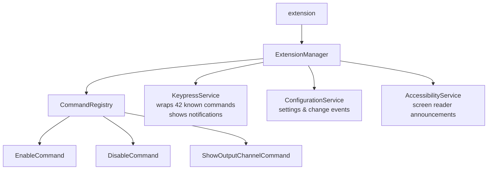
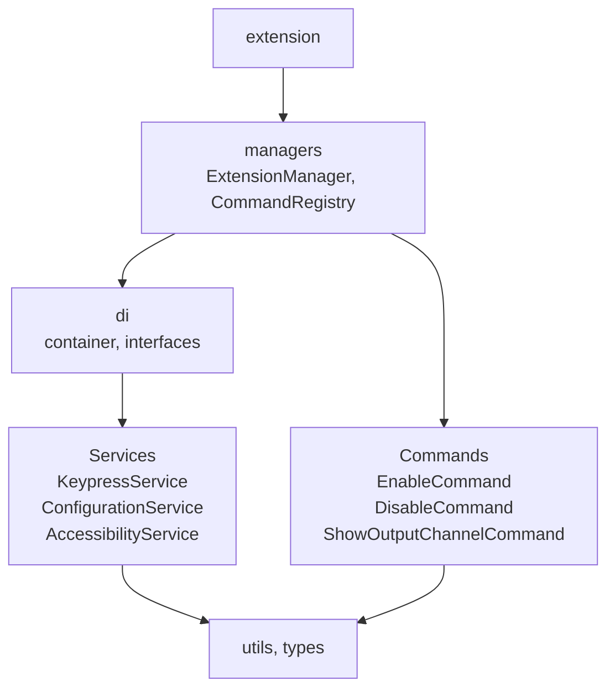

# Keypress Notifications

<p align="center">
  
</p>

[](https://github.com/Vijay431/keypress-notifications/actions/workflows/ci.yml)
[](https://marketplace.visualstudio.com/items?itemName=VijayGangatharan.keypress-notifications)
[](https://marketplace.visualstudio.com/items?itemName=VijayGangatharan.keypress-notifications)
[](https://marketplace.visualstudio.com/items?itemName=VijayGangatharan.keypress-notifications)
[](https://open-vsx.org/extension/VijayGangatharan/keypress-notifications)
[](LICENSE)

**Never lose track of which shortcut you just pressed.**

---

## The Problem

VS Code gives you zero feedback about which keyboard shortcut you triggered. You pressed *something* — but what?

This tiny blind spot compounds fast: during screencasts and tutorials, your audience can't follow your keystrokes. In pair-programming sessions, your colleague doesn't know what you just did. When streaming or presenting, viewers stare at a result with no context. And when you're *learning* new keybindings yourself, muscle memory can't form if nothing confirms you hit the right combo.

Keypress Notifications plugs that gap. Every time you trigger one of **42 common VS Code keybindings**, a toast notification pops up — **"You've pressed Ctrl+C"** — so there's always on-screen confirmation of what happened.

---

## ⬇️ Install in 30 seconds

**VS Code Marketplace** (recommended):

```
ext install VijayGangatharan.keypress-notifications
```

Or search **"Keypress Notifications"** in the Extensions view (`Ctrl+Shift+X`).

**Open VSX** (VS Codium / other open-source VS Code builds):
[open-vsx.org/extension/VijayGangatharan/keypress-notifications](https://open-vsx.org/extension/VijayGangatharan/keypress-notifications)

**Command line:**
```bash
code --install-extension VijayGangatharan.keypress-notifications
```

---

## 🎯 Quick Start

New to Keypress Notifications? Up and running in 2 minutes:

1. **Install** from VS Code Marketplace
2. **Open** any file in VS Code
3. **Press** a supported shortcut (e.g. `Ctrl+S` to save)
4. **See** the toast notification — _"You've pressed Ctrl+S"_

That's it. No configuration needed for the default experience.

---

## 🌟 Why Keypress Notifications?

| ❌ Without it | ✅ With Keypress Notifications |
| --- | --- |
| No on-screen feedback when you press a shortcut | Toast notification confirms every triggered keybinding |
| Screencasts: viewers see the result but not the key | Toast shows the shortcut label as you press it |
| Pair programming: partner misses your keystrokes | Your keys are visible without any extra screen-share setup |
| Learning shortcuts: muscle memory can't form without feedback | Instant reinforcement each time you press the right combo |
| Accessibility: no text confirmation alongside a screen reader | On-screen text for every action |

---

## 🎬 Demo

<div align="center">


_On-screen toast for every supported keybinding_

</div>

<details>
<summary>Record your own demo</summary>

See [`public/`](public/) for a short recording guide — capture your own workflow to share with your team or audience.

</details>

---

## Who It's For

- **Screencasters & YouTube/course creators** — your shortcuts are always visible on screen
- **Live streamers** — viewers on Twitch or YouTube Live always know what you're doing
- **Teachers & workshop leads** — no more "wait, what did you just press?"
- **Pair programmers** — your partner sees your keystrokes without screen-sharing tools that need special setup
- **Accessibility users** — on-screen text confirmation of every action, alongside whatever screen reader you use
- **Keybinding learners** — instant reinforcement every time you hit the right combo

---

## ✨ Features

### Shortcut notifications

Every time you trigger one of the supported shortcuts, a VS Code information notification appears — e.g. **"You've pressed Ctrl+C"**.

Supported shortcuts (Ctrl = Cmd on macOS):

**Editor**

| Shortcut | Action |
|---|---|
| Ctrl+C | Copy |
| Ctrl+X | Cut |
| Ctrl+V | Paste |
| Ctrl+Z | Undo |
| Ctrl+Y | Redo |
| Ctrl+A | Select All |
| Ctrl+F | Find |
| Ctrl+H | Find & Replace |
| Alt+Up | Move Line Up |
| Alt+Down | Move Line Down |
| Shift+Alt+Up | Copy Line Up |
| Shift+Alt+Down | Copy Line Down |
| Ctrl+Shift+K | Delete Line |
| Ctrl+. | Quick Fix |
| Shift+Alt+F | Format Document |
| Ctrl+/ | Toggle Line Comment |
| Ctrl+D | Add Selection to Next Match |

**Explorer**

| Shortcut | Action |
|---|---|
| Ctrl+C | Copy File/Folder |
| Ctrl+X | Cut File/Folder |
| Ctrl+V | Paste File/Folder |

**Workbench / navigation**

| Shortcut | Action |
|---|---|
| Ctrl+S | Save |
| Ctrl+K S | Save All |
| Ctrl+Shift+P | Command Palette |
| Ctrl+P | Quick Open |
| Ctrl+Shift+F | Find in Files |
| Ctrl+G | Go to Line |
| Ctrl+B | Toggle Sidebar |
| Ctrl+\` | Toggle Terminal |
| Ctrl+J | Toggle Panel |
| Ctrl+W | Close Editor |
| Ctrl+Shift+N | New Window |
| Ctrl+N | New File |
| Ctrl+O | Open File |
| Ctrl+\\ | Split Editor |
| Ctrl+Shift+T | Reopen Closed Editor |
| Ctrl+Shift+O | Go to Symbol |
| Ctrl+, | Open Settings |
| Ctrl+Shift+G | Source Control |
| Ctrl+Shift+X | Extensions |
| Ctrl+Shift+D | Debug |
| Ctrl+Shift+M | Problems |

**Terminal**

| Shortcut | Action |
|---|---|
| Ctrl+Shift+\` | New Terminal |

### Configuration

All settings live under the `keypress-notifications.*` namespace:

| Setting | Type | Default | Description |
|---|---|---|---|
| `enabled` | boolean | `true` | Enable or disable notifications |
| `minimumKeys` | number | `2` | Minimum number of keys in a combination before a notification fires |
| `excludedCommands` | string[] | `[]` | Commands to suppress notifications for |
| `showCommandName` | boolean | `false` | Include the VS Code command ID in the notification message |
| `logLevel` | string | `"info"` | Logging verbosity: `"debug"`, `"info"`, `"warn"`, or `"error"` |

### Commands

Open the Command Palette (`Ctrl+Shift+P`) and search for:

| Command | Description |
|---|---|
| **Keypress Notifications: Enable** | Turn notifications on |
| **Keypress Notifications: Disable** | Turn notifications off |
| **Keypress Notifications: Show Status** | Open the extension output channel |

---

## 📋 Requirements

- VS Code **1.111.0** or later

---

## ❓ Troubleshooting & FAQ

<details>
<summary>Notifications not appearing</summary>

**Problem**: Pressing a shortcut produces no notification.

**Solutions:**
1. **Check extension status**: open Command Palette → _Keypress Notifications: Show Status_ — look for `enabled: true` in the output.
2. **Enable the extension**: Command Palette → _Keypress Notifications: Enable_.
3. **Check `minimumKeys`**: default is `2`, so single-key presses won't fire. Lower it in settings if needed.
4. **Check `excludedCommands`**: the command may be in your exclusion list.
5. **Unsupported shortcut**: notifications only fire for the [42 curated keybindings](#shortcut-notifications) above — arbitrary shortcuts are not wrapped.

</details>

<details>
<summary>Shortcut not in the list</summary>

**Problem**: A keybinding you use regularly doesn't trigger a notification.

The extension wraps a curated set of 42 common commands. To request coverage for a shortcut, [open an issue](https://github.com/Vijay431/keypress-notifications/issues) with the VS Code command ID and your use case.

</details>

<details>
<summary>Notifications are too noisy</summary>

**Solutions:**
- Add commands to `keypress-notifications.excludedCommands` (use the VS Code command ID, e.g. `editor.action.clipboardCopyAction`).
- Raise `keypress-notifications.minimumKeys` to suppress shorter combos.

</details>

<details>
<summary>Debugging steps</summary>

1. Open Command Palette → **Keypress Notifications: Show Status** to view the output channel.
2. Set `keypress-notifications.logLevel` to `"debug"` for verbose output.
3. Reload VS Code window (`Ctrl+Shift+P` → _Reload Window_).
4. [Report issues](https://github.com/Vijay431/keypress-notifications/issues) with the output channel log and VS Code version.

</details>

<details>
<summary>Frequently Asked Questions</summary>

**Q: Does this work in all workspaces?**
A: Yes — Keypress Notifications activates on startup and works in any workspace or file type.

**Q: Will this interfere with my existing keybindings?**
A: The extension registers wrapper commands for the 42 curated shortcuts. Each wrapper executes the original command first, then shows the notification — so the underlying action always runs as normal.

**Q: Can I use this with a screen reader?**
A: Yes. The notification text is readable by screen readers (NVDA, VoiceOver, Orca). Combined with the on-screen toast, every action has visible and audible confirmation.

**Q: Does this affect performance?**
A: No. The extension has zero runtime dependencies and the notification overhead is negligible — a single `vscode.window.showInformationMessage` call per keypress.

</details>

---

## 🐛 Known Issues & Limitations

- **Curated coverage only**: notifications fire for the 42 wrapped commands listed above — not for arbitrary or custom keybindings.
- **Wrapper model**: notifications are triggered by the wrapper command, not by the raw keypress event, so remapped shortcuts that bypass the wrapper won't fire.
- **VS Code 1.111.0+**: older engine versions are not supported.

**Reporting Issues**: [open an issue](https://github.com/Vijay431/keypress-notifications/issues) with:
- VS Code version
- Extension version
- Output from _Keypress Notifications: Show Status_
- Steps to reproduce

---

## 📦 Release Notes

### Latest — [2.0.0]

- **42 wrapped commands**: expanded from 19, now covering Editor, Explorer, Workbench, and Terminal.
- **DI architecture**: full dependency-injection container, typed service layer, zero runtime dependencies.
- **MIT license**: open source.

For the full history, see [CHANGELOG.md](CHANGELOG.md).

---

## 🏗️ Architecture

### Runtime Architecture


```mermaid
flowchart TD
    A["extension"] --> B["ExtensionManager"]
    B --> C["CommandRegistry"]
    C --> D["EnableCommand"]
    C --> E["DisableCommand"]
    C --> F["ShowOutputChannelCommand"]
    B --> G["KeypressService<br/>wraps 42 known commands<br/>shows notifications"]
    B --> H["ConfigurationService<br/>settings & change events"]
    B --> I["AccessibilityService<br/>screen reader announcements"]
```

### Codebase Structure


```mermaid
flowchart TD
    A["extension"] --> B["managers<br/>ExtensionManager, CommandRegistry"]
    B --> C["di<br/>container, interfaces"]
    C --> D["Services<br/>KeypressService<br/>ConfigurationService<br/>AccessibilityService"]
    B --> E["Commands<br/>EnableCommand<br/>DisableCommand<br/>ShowOutputChannelCommand"]
    D --> F["utils, types"]
    E --> F
```

---

## 🤝 Contributing

Contributions are welcome. See [CONTRIBUTING.md](CONTRIBUTING.md) for guidelines.

### 🛠️ Development Setup

**Prerequisites**: Node.js 22+, pnpm, VS Code 1.111+.

```bash
# 1. Clone and install
git clone https://github.com/Vijay431/keypress-notifications.git
cd keypress-notifications
pnpm install

# 2. Build
pnpm run build

# 3. Launch Extension Development Host
# Press F5 in VS Code
```

<details>
<summary>Available development commands</summary>

| Command | Description |
|---|---|
| `pnpm run build` | Build extension (~1s) |
| `pnpm run watch` | Watch mode |
| `pnpm run package` | Production build (.vsix) |
| `pnpm run lint` | Run ESLint |
| `pnpm run lint:fix` | Auto-fix lint issues |
| `pnpm run format` | Format with Prettier |
| `pnpm run check-types` | TypeScript type check (no emit) |
| `pnpm run test:unit` | Unit tests (Vitest) |
| `pnpm run test:unit:coverage` | Unit tests with LCOV coverage |
| `pnpm run test:integration` | Integration tests (Mocha + VS Code, needs display) |

</details>

---

## Contributors

Thanks goes to these wonderful people:

<!-- ALL-CONTRIBUTORS-LIST:START -->
<!-- prettier-ignore-start -->
<!-- markdownlint-disable -->
<!-- markdownlint-restore -->
<!-- prettier-ignore-end -->

<!-- ALL-CONTRIBUTORS-LIST:END -->

This project follows the [all-contributors](https://allcontributors.org) specification. Contributions of any kind are welcome.

See [CONTRIBUTORS.md](CONTRIBUTORS.md) for the full contributors list.

---

## 👨‍💻 Developer

**Vijay Gangatharan**

- 📧 Email: <vijayanand431@gmail.com>
- 🐙 [GitHub Repository](https://github.com/Vijay431/keypress-notifications)
- 🌐 [VS Code Marketplace](https://marketplace.visualstudio.com/items?itemName=VijayGangatharan.keypress-notifications)

---

## 🙏 Acknowledgments

Special thanks to:

- The VS Code Extension API team for excellent documentation
- The TypeScript and JavaScript developer communities
- All contributors and users who provide feedback

---

## 📄 License

[MIT](LICENSE)

---

<div align="center">

**🚀 Enjoy Keypress Notifications! 🚀**

_If this extension helps your workflow, please consider [leaving a review](https://marketplace.visualstudio.com/items?itemName=VijayGangatharan.keypress-notifications&ssr=false#review-details) ⭐_

</div>
